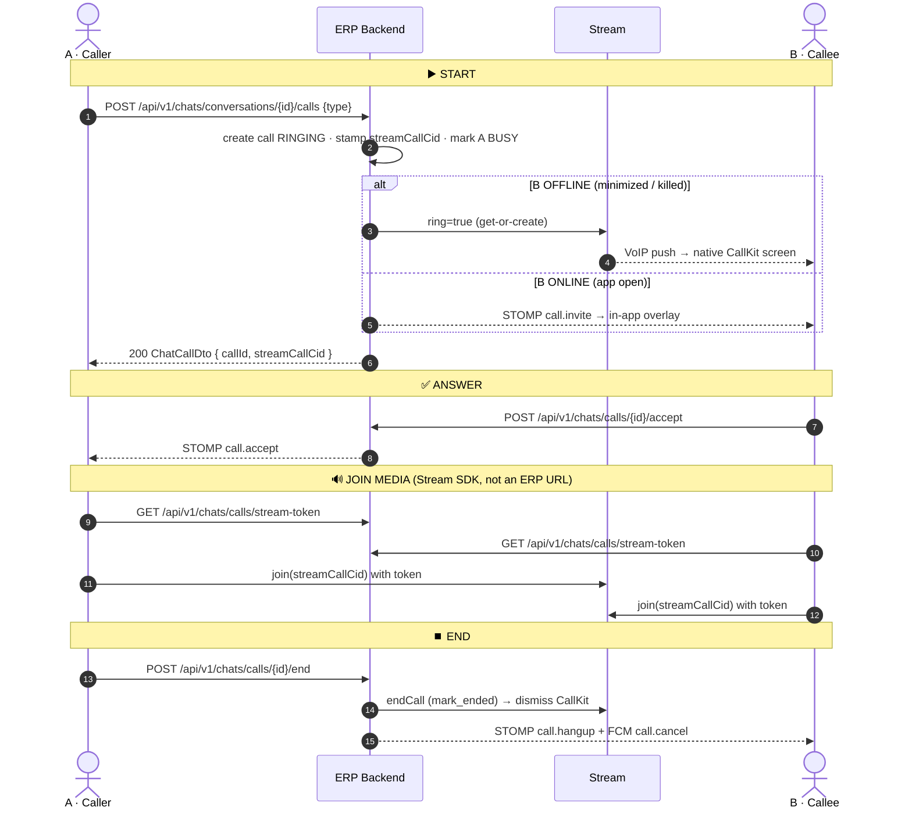
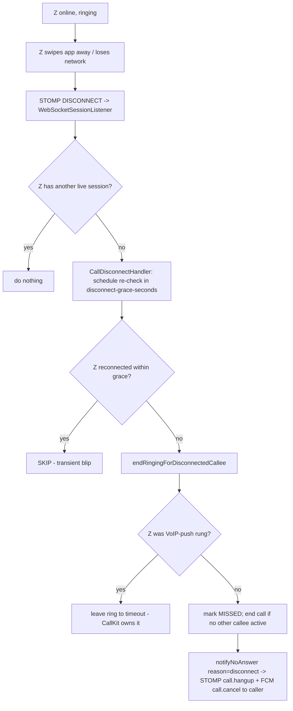

# Call Flow (Voice / Video)

How the backend signals 1:1 and group calls, and how it rings callees on mobile —
including when the app is foreground, minimized, or killed.

> Scope: server-side behaviour under `features/chats`. The Flutter client joins
> Stream for media but **never rings client-side** (`ring: false`) — ringing it
> client-side contends for the iOS audio session and breaks audio, so all ringing
> originates from the backend.

> Hands-on test walkthrough (curl per step, which file to read): [CALL_TEST_FLOW.md](CALL_TEST_FLOW.md).

---

## 0. Overview diagram



```
        A (caller)                  ERP Backend                 Stream            B (callee)
            │  POST .../calls            │                         │                  │
            │ ─────────────────────────► │ create RINGING, CID     │                  │
            │                            │ ── ring=true ─────────► │ ── VoIP push ──► │ CallKit (if OFFLINE)
            │                            │ ── STOMP call.invite ───────────────────►  │ in-app (if ONLINE)
            │ ◄───── 200 {callId, CID} ──│                         │                  │
            │                            │ ◄──── POST .../accept ─────────────────────│
            │ ◄──── STOMP call.accept ───│                         │                  │
            │  GET .../stream-token      │                         │                  │  GET .../stream-token
            │ ──── join(CID) ──────────────────────────────────►  │ ◄── join(CID) ───│
            │  POST .../end              │                         │                  │
            │ ─────────────────────────► │ ── endCall(mark_ended)► │ ── cancel ─────► │ CallKit dismissed
```

---

## 1. Components

| Component | File | Role |
|---|---|---|
| `ChatCallController` | [controller/ChatCallController.java](../src/main/java/com/company/erp/features/chats/controller/ChatCallController.java) | REST endpoints; fans out STOMP + FCM |
| `ChatCallService` | [service/ChatCallService.java](../src/main/java/com/company/erp/features/chats/service/ChatCallService.java) | State machine (start/accept/reject/hangup/sweep) |
| `StreamVideoService` | [service/StreamVideoService.java](../src/main/java/com/company/erp/features/chats/service/StreamVideoService.java) | Server-side Stream Video REST: `ring` + `endCall` |
| `StreamTokenService` | [service/StreamTokenService.java](../src/main/java/com/company/erp/features/chats/service/StreamTokenService.java) | Mints Stream user tokens; deterministic call CID |
| `PresenceService` | [presence/PresenceService.java](../src/main/java/com/company/erp/features/chats/presence/PresenceService.java) | Online/offline/busy from live STOMP sessions |
| `CallTimeoutScheduler` | [service/CallTimeoutScheduler.java](../src/main/java/com/company/erp/features/chats/service/CallTimeoutScheduler.java) | Auto-ends calls stuck RINGING past timeout |
| `CallDisconnectHandler` | [service/CallDisconnectHandler.java](../src/main/java/com/company/erp/features/chats/service/CallDisconnectHandler.java) | Fast-ends a ring when an online callee's socket drops (swap-away / force-quit) |
| `WebSocketSessionListener` | [presence/WebSocketSessionListener.java](../src/main/java/com/company/erp/features/chats/presence/WebSocketSessionListener.java) | STOMP connect/disconnect → presence + disconnect handler |
| `FcmService` | [devices/service/FcmService.java](../src/main/java/com/company/erp/features/devices/service/FcmService.java) | Data-only FCM pushes |
| `ChatBroadcaster` | `features/chats/ws/ChatBroadcaster.java` | STOMP fan-out to topics/user queues |

### Four signalling channels

1. **REST** — the caller/callee drive state (`POST .../calls`, `/accept`, `/reject`, `/end`).
2. **STOMP (WebSocket)** — live events to **foreground** apps (`call.invite`, `call.accept`, `call.reject`, `call.hangup`).
3. **Stream VoIP push** — Stream's get-or-create with `ring: true` raises the **native CallKit (iOS) / ConnectionService (Android)** incoming-call screen on **backgrounded/killed** devices.
4. **FCM data push** — `call.invite` (data-only, draws the Android call sheet) and `call.cancel` (dismiss a lingering ring).

---

## 2. The one Stream call per ERP call

When a call row is created, the backend stamps a **deterministic Stream CID**:

```
streamCallCid = "default:erp-call-" + callId      // e.g. default:erp-call-1220
```

`StreamTokenService.cidForCall(id)`. Everyone — caller and callees — joins this
exact call for media. The server's `ring`/`endCall` use the same CID, so the push
that raises CallKit and the one that dismisses it target the same call.

---

## 3. State machines

**Call** (`CallStatus`): `RINGING → ANSWERED → ENDED`, or `RINGING → REJECTED / MISSED`.

**Participant** (`ParticipantStatus`): `RINGING → ANSWERED → LEFT`, or `RINGING → REJECTED / MISSED`.
The caller starts as `ANSWERED` (they're in from t=0).

`MISSED` end reasons: `no_answer` (timeout), `callee_disconnected`. Active call ends:
`caller_left`, `all_callees_left`, `rejected`.

---

## 4. Endpoints

All under `/api/v1/chats`, JWT-authenticated.

| Method | Path | Purpose |
|---|---|---|
| `POST` | `/conversations/{convId}/calls` | **Start** a call; rings offline callees |
| `POST` | `/calls/{id}/accept` | Callee answers → `ANSWERED`, marked BUSY |
| `POST` | `/calls/{id}/reject?reason=` | Callee declines |
| `POST` | `/calls/{id}/end` | Hang up (caller ends for all; last callee ends the call) |
| `GET`  | `/calls/{id}` | Current state (reconnect reconciliation) |
| `GET`  | `/calls` · `/conversations/{convId}/calls` | History |
| `GET`  | `/calls/stream-token` | Mint Stream Video token for the media SDK |

Presence (used to gate ringing): `GET /api/v1/chats/presence`, `GET /api/v1/chats/presence/{userId}`.

### By user action — which URL to call

Base URL `http://localhost:8080`. All require `Authorization: Bearer <accessToken>`.
`{id}` = callId, `{convId}` = conversationId.

| User action | Method + full URL | Body / params | Notes |
|---|---|---|---|
| **Start a call** | `POST /api/v1/chats/conversations/{convId}/calls` | `{"type":"VOICE"}` or `{"type":"VIDEO"}` | Returns `ChatCallDto` incl. `callId` + `streamCallCid`. Rings offline callees. |
| **Get media token** (before join) | `GET /api/v1/chats/calls/stream-token` | — | Returns `{ token, apiKey, userId, expiresAt }` for the Stream SDK. |
| **Join the call (media)** | *no ERP URL* — Stream SDK | `streamCallCid` + token + apiKey | Client joins Stream directly with `ring:false`. The CID comes from start/accept response. |
| **Answer** | `POST /api/v1/chats/calls/{id}/accept` | — | Marks ANSWERED; then get token + join. |
| **Decline** | `POST /api/v1/chats/calls/{id}/reject?reason=busy` | `reason` optional | |
| **Hang up / end** | `POST /api/v1/chats/calls/{id}/end` | — | Caller ends for all; last callee ends the call. |
| **Get call state** (reconnect) | `GET /api/v1/chats/calls/{id}` | — | Reconcile after a dropped connection. |
| **My call history** | `GET /api/v1/chats/calls?page=1&pageSize=30` | paging | Newest first. |
| **Conversation call history** | `GET /api/v1/chats/conversations/{convId}/calls` | paging | Chat-info "recent calls". |
| **Check who's online** | `GET /api/v1/chats/presence/{userId}` | — | `ONLINE / BUSY / OFFLINE`. |

> **"Join the call" has no backend endpoint.** Joining = the mobile **Stream SDK** connecting
> to the media call identified by `streamCallCid` (e.g. `default:erp-call-1220`), using the
> token from `GET /calls/stream-token`. The ERP backend only does *signalling* (start/accept/
> reject/end) + the server-side ring; the audio/video itself rides Stream. See §2.

---

## 5. Start a call — the ring-gating decision

`POST /conversations/{convId}/calls` → `ChatCallService.start()`:

1. Guard: caller must be a member and not already in an active call.
2. Create the `chat_calls` row (`RINGING`), stamp `streamCallCid`.
3. Create `chat_call_participants`: caller `ANSWERED`, every other member `RINGING`.
4. Mark caller **BUSY**.
5. **Decide who gets the Stream VoIP push** — only callees who are **OFFLINE**:

   ```java
   ringTargets = members - caller, filtered to presence.statusOf(uid) == OFFLINE
   ```

   - **OFFLINE** = no live STOMP session ⇒ app backgrounded/killed (the Flutter
     client drops its WebSocket on background). These devices can *only* be rung
     by a VoIP push → CallKit.
   - **ONLINE / BUSY** = WebSocket up ⇒ already gets the STOMP `call.invite` and
     shows the **in-app** overlay. Pushing VoIP to a foreground device caused a
     duplicate native ring header **and** an audio-session fight (CallKit + WebRTC
     both grabbing `AVAudioSession` → silence). So foreground devices are **not** VoIP-rung.

6. If `ringTargets` non-empty → `streamVideo.ring(cid, callerId, {caller}+ringTargets, isVideo)`.
   The caller is included so Stream makes them the **creator** (creators are not rung).
   Group rule: ring fires if **at least one** callee is offline (only the offline ones receive it).
7. Remember the VoIP-rung set (`pushRungCallees`) so a later socket drop doesn't cancel a CallKit ring it doesn't own.

Then the **controller** always, regardless of ring gating:
- STOMP `call.invite` to the conversation topic **and** each callee's user queue,
- FCM data `call.invite` to every callee's devices (`pushInvite`).

> Note: today the gating filters to OFFLINE callees. To force a ring on every call
> (e.g. for testing), `start()` is the only place that decides `ringTargets`.

### Stream get-or-create body (`StreamVideoService.ring`)

```
POST https://video.stream-io-api.com/api/v2/video/call/default/erp-call-{id}?api_key=...
Authorization: <caller's Stream user token>     stream-auth-type: jwt
{
  "ring": true,
  "data": {
    "members": [ {"user_id":"<caller>"}, {"user_id":"<offline callee>"} ],
    "settings_override": { "video": { "enabled": <isVideo>, "camera_default_on": <isVideo> } }
  }
}
```

- Auth: the **caller's** user token (same HMAC token the mobile SDK uses) → caller is creator → push goes to other members, not back to caller. No `created_by_id` needed.
- `settings_override.video` drives the `video` flag Stream stamps into the VoIP push, which the iOS CallKit header renders as **"Video"** vs **"Audio"**. Voice calls send `false` so they ring as Audio.
- `@Async` + swallows all errors — a Stream hiccup never breaks call signalling.

```mermaid
flowchart TD
  A[POST /conversations/{id}/calls] --> B[create call + participants, stamp CID]
  B --> C[mark caller BUSY]
  C --> D{any callee OFFLINE?}
  D -- yes --> E[streamVideo.ring ring:true to offline callees -> CallKit]
  D -- no  --> F[skip VoIP ring]
  E --> G
  F --> G[controller: STOMP call.invite + FCM call.invite to all callees]
  G --> H[return ChatCallDto with streamCallCid]
```

---

## 6. Accept

`POST /calls/{id}/accept` → `ChatCallService.accept()`:
- **Grace revival:** if the sweeper just marked it `MISSED` but the accept arrives within
  `ringTimeout + acceptGrace` seconds, restore `RINGING` (handles late FCM-driven accepts).
- Participant → `ANSWERED` (+`joinedAt`); call → `ANSWERED` (+`answeredAt`) on first answer; mark accepter **BUSY**.
- Controller: STOMP `call.accept`; FCM `call.cancel` to the accepter's **other** devices (stop them ringing).

The client then joins the Stream call (CID) for media.

---

## 7. Reject

`POST /calls/{id}/reject?reason=` → participant → `REJECTED`. If no other callee is still
active (1:1 case), the call ends `REJECTED`. Controller: STOMP `call.reject`; if terminal,
`pushCancelOnTerminal` fans FCM `call.cancel` to anyone still ringing.

---

## 8. Hang up / End

`POST /calls/{id}/end` → `ChatCallService.hangup()`:
- **Caller** ends → whole call `ENDED` (`caller_left`).
- **Callee** ends → if no other callee active → `ENDED` (`all_callees_left`); else call continues and that user clears BUSY.

Controller: STOMP `call.hangup`; `pushCancelOnTerminal` → FCM `call.cancel` to remaining ringers.

---

## 9. Terminal cleanup — `endCallInternal` (single chokepoint)

Every terminal end (`caller_left`, `all_callees_left`, `rejected`, `no_answer`,
`callee_disconnected`) funnels through `endCallInternal`, which:
- sets status/`endedAt`/`endReason`, computes `durationSeconds` (from `answeredAt`),
- clears BUSY for all active participants + caller,
- drops `pushRungCallees` tracking,
- **`streamVideo.endCall(cid, callerId)`** → Stream `mark_ended`.

`mark_ended` is the **only reliable way** to dismiss a backgrounded/killed iOS callee's
CallKit screen: its STOMP and Stream WebSocket are both down, so neither a `call.hangup`
frame nor a Stream WS event reaches it. `mark_ended` cancels the ring through the same
VoIP/APNs channel that raised it. A 404/400 is harmless (call was never created on Stream
because all callees were online).

---

## 10. Timeout & disconnect

- **Ring timeout sweep** — `CallTimeoutScheduler.sweep()` runs every `sweep-interval-ms`
  (5s). Any call `RINGING` longer than `ring-timeout-seconds` (60s) → `MISSED`/`no_answer`
  via `sweepStaleRinging()`; `CallEndNotifier.notifyNoAnswer` fans STOMP `call.hangup` +
  FCM `call.cancel`. (Terminal cleanup also fires `streamVideo.endCall`.)
- **Callee disconnect** — `endRingingForDisconnectedCallee(userId)` (on STOMP DISCONNECT):
  a still-`RINGING` callee whose socket drops → `MISSED`; if they were **VoIP-push rung**
  (`pushRungCallees`), their CallKit ring is independent of the socket, so it's **left to
  the timeout, not cancelled**. Group calls with other live callees keep ringing.

---

## 11. Swap-away / force-quit (online callee disappears mid-ring)

Scenario: **X calls Z. Z is online** (foreground, showing the in-app overlay), then
**swipes the app away** (force-quit) or loses network. Z's STOMP socket drops. Without
special handling X would keep ringing until the 60s timeout. The swap-away flow ends it fast.

Path:

1. STOMP `DISCONNECT` → `WebSocketSessionListener.onDisconnect()` calls
   `presence.disconnect(sessionId)` (now returns the `userId`).
2. If that user has **no remaining live session** → `CallDisconnectHandler.onUserConnectionDropped(userId)`.
3. The handler **schedules a re-check** after `disconnect-grace-seconds` (default **5s**) on a
   daemon executor — it does **not** cancel immediately.
4. On re-check (`resolve`):
   - **Reconnected?** `presence.hasLiveSession(userId)` true → **skip** (it was a transient
     network blip; the client came back).
   - **Still gone?** → `callService.endRingingForDisconnectedCallee(userId)`:
     - For each call where they're still a `RINGING` callee, mark them `MISSED`.
     - **Per-call distinction:** a callee who was **VoIP-push rung** (`pushRungCallees` — i.e.
       they were already OFFLINE at call start) keeps a native CallKit ring independent of the
       socket → **left to the ring timeout, not cancelled**. A **STOMP-only** callee (was
       online, no VoIP push) just lost their *only* ring channel → **cancel it**.
     - If no other callee stays active → end the call `MISSED` / `callee_disconnected` (which,
       via `endCallInternal`, also fires `streamVideo.endCall`). Group calls with other live
       callees keep ringing.
   - `CallEndNotifier.notifyNoAnswer(call, "disconnect")` → STOMP `call.hangup` + FCM
     `call.cancel` so the **caller** stops ringing immediately.

Important nuances (from the code):
- A callee **OFFLINE at call time** never had a STOMP session, so this path never fires for
  them — their ring is governed solely by the ring timeout + `streamVideo.endCall` on terminal end.
- `resolve` deliberately does **not** skip on `isBackgrounded`: Android also sends a
  "backgrounded" beacon on swipe-away, which would wrongly suppress the cancel. The real
  "still ringing via VoIP push?" decision is made per-call inside
  `endRingingForDisconnectedCallee` (push-rung → keep; STOMP-only → cancel).



> Contrast with **§10 ring timeout**: the timeout (60s) is the catch-all for *any* unanswered
> ring; swap-away (5s) is the *fast path* for an online callee who vanishes. Both converge on
> `endCallInternal` → `streamVideo.endCall`.

---

## 12. Behaviour matrix

| Callee state | STOMP `call.invite` | VoIP ring (CallKit) | FCM `call.invite` | Result |
|---|---|---|---|---|
| Foreground (ONLINE) | ✅ | ❌ (gated off) | ✅ | In-app overlay only; no native screen, clean audio |
| In another call (BUSY) | ✅ | ❌ | ✅ | In-app handling |
| Minimized / killed (OFFLINE) | ✗ (socket down) | ✅ `ring:true` | ✅ | Native CallKit / call sheet |

On any terminal end, a lingering CallKit ring is dismissed by `streamVideo.endCall` (Stream `mark_ended`) and/or FCM `call.cancel`.

---

## 13. Config

[application.yml](../src/main/resources/application.yml) → `app.chat.call` and `app.stream`:

| Key | Env | Default | Meaning |
|---|---|---|---|
| `ring-timeout-seconds` | `CHAT_CALL_RING_TIMEOUT_SECONDS` | 60 | RINGING → MISSED deadline (match Stream's autoCancelTimeout) |
| `accept-grace-seconds` | `CHAT_CALL_ACCEPT_GRACE_SECONDS` | 5 | Late-accept revival window |
| `disconnect-grace-seconds` | `CHAT_CALL_DISCONNECT_GRACE_SECONDS` | 5 | Swap-away grace: wait this long after an online ringing callee's socket drops before auto-ending (rides out reconnect blips) |
| `sweep-interval-ms` | — | 5000 | Sweeper tick |
| `stream.api-key` / `api-secret` | `STREAM_API_KEY` / `STREAM_API_SECRET` | — | Stream project creds (token + ring/endCall) |
| `stream.token-ttl-minutes` | `STREAM_TOKEN_TTL_MINUTES` | 60 | Stream user-token TTL |
| `fcm.enabled` / path | `FCM_ENABLED` / `FCM_SERVICE_ACCOUNT_JSON_PATH` | false | FCM pushes |

**Preconditions** (Stream Dashboard): APN provider `apn` (iOS) + Firebase provider
`firebase` (Android) configured; the mobile app registers each device with Stream for push.

---

## 14. Logs to watch

```
[call] START requested ... / START ok callId=… streamCallCid=…
[call] callId=… — ringing OFFLINE callees via VoIP push: [..]
[call] callId=… — all callees ONLINE; skipping Stream VoIP ring …
[stream] rang call cid=… members=N video=true|false
[stream] ring failed cid=… status=… body=…
[call] ACCEPT ok … / REJECT … / END ok … reason=…
[call] AUTO-MISSED callId=… after Ns
[call-disconnect] user=… socket dropped — re-check in 5s
[call-disconnect] SKIP user=… — reconnected within grace (live session)
[call-disconnect] callee=… gone — auto-ended N ringing call(s)
[fcm] call.invite … / call.cancel …
```
