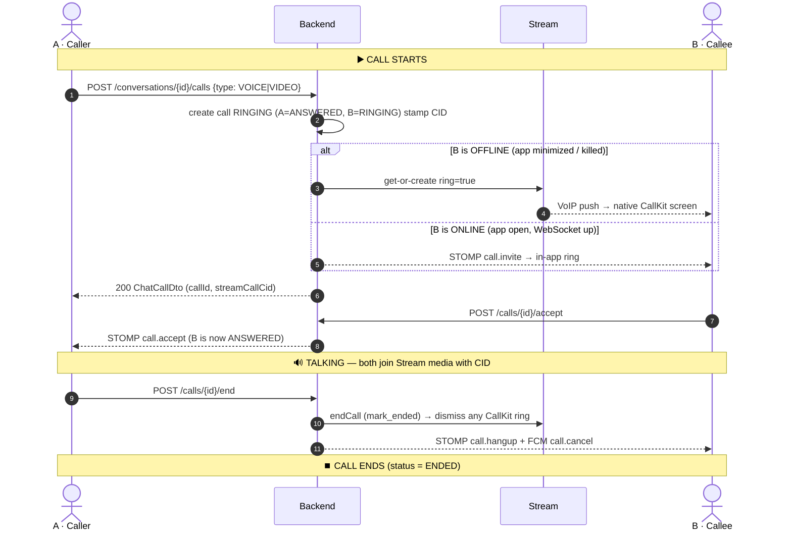
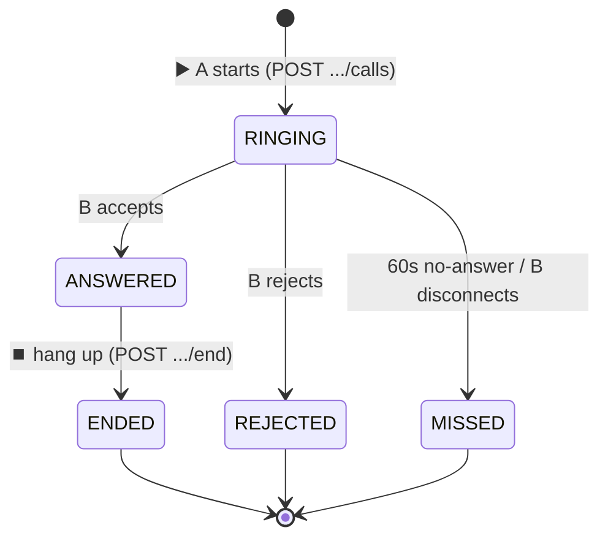

# Call Test Flow — "A calls B" end to end

A hands-on, step-by-step trace of one call: **A (caller)** rings **B (callee)**, B answers,
someone hangs up. For each step: the **API / channel** to hit, what to expect, and the
**source file to read** to understand it.

- Base URL: `http://localhost:8080`  (all REST under `/api/v1`)
- Conceptual / why-it-works companion: [CALL_FLOW.md](CALL_FLOW.md)
- Test accounts in the imported data: `a@gmail.com` (user **9**) and `b@gmail.com` (user **10**);
  their 1:1 conversation is **id 18**. (See `users` / `chat_conversations` in the DB.)

> Terminology: **A = caller**, **B = callee**. Replace `$A_TOKEN`, `$B_TOKEN`, `$CONV`,
> `$CALL_ID`, `$CID` as you go.

---

## Diagram — the whole call at a glance

**▶️ where it STARTS** = `POST /conversations/{id}/calls` · **⏹️ where it ENDS** = `POST /calls/{id}/end`
(or reject / 60s timeout / swipe-away). Everything in between is the same one call (`$CALL_ID` / `$CID`).



**Call status lifecycle** (what the `status` field becomes):



| Marker | Endpoint | Status after |
|---|---|---|
| ▶️ **START** | `POST /api/v1/chats/conversations/{id}/calls` | `RINGING` |
| ✅ answer | `POST /api/v1/chats/calls/{id}/accept` | `ANSWERED` |
| ⏹️ **END** | `POST /api/v1/chats/calls/{id}/end` | `ENDED` |
| ✋ reject | `POST /api/v1/chats/calls/{id}/reject` | `REJECTED` |
| ⏰ no answer | (auto after 60s) | `MISSED` |

> Mermaid renders automatically on GitHub and in VS Code's Markdown preview
> (Cmd+Shift+V). The detailed steps below match the numbered arrows above.

---

## ASCII diagram (renders anywhere)

### ▶️ START — A taps Call

```
┌──────────────────────────── A's phone (caller) ───────────────────────────┐
│  Call UI ── tap Call ──►  POST /api/v1/chats/conversations/{id}/calls      │
└───────────────────────────────────┬───────────────────────────────────────┘
                                     │  HTTPS (Authorization: Bearer JWT)
                                     ▼
┌─────────────────────────── Backend (Spring Boot :8080) ───────────────────┐
│  ChatCallController.start()                                                 │
│      │  require member · reject if caller already in a call                 │
│      ▼                                                                      │
│  ChatCallService.start()                                                    │
│      ├─ INSERT chat_calls            (status = RINGING)  ◄── call is born   │
│      ├─ participants: A = ANSWERED, B = RINGING                             │
│      ├─ stamp streamCallCid = default:erp-call-{callId}                     │
│      ├─ PresenceService.statusOf(B)  →  ONLINE  or  OFFLINE ?               │
│      └─ if B OFFLINE → StreamVideoService.ring(ring=true)                   │
│      │                                                                      │
│      ▼  controller fan-out (ALWAYS, both channels)                         │
│  ChatBroadcaster ──STOMP──► /user/queue/calls  +  /topic/.../call           │
│  FcmService      ──FCM ───► B's devices (data: call.invite)                │
└──────┬──────────────────────────────────────────────────┬──────────────────┘
       │ Stream REST: ring                                 │ STOMP + FCM
       ▼                                                   ▼
  Stream Video ──VoIP push──► B's native CallKit      B's app in-app ring
       (only when B was OFFLINE)                       (when B was ONLINE)
```

### Who rings on B — by B's app state

```
A taps Call ── ChatCallService.start()
                      │
        ┌─────────────┴──────────────┐
        ▼                            ▼
   B ONLINE (WebSocket up)      B OFFLINE (no WebSocket)
   STOMP call.invite            StreamVideoService.ring(ring=true)
   in-app overlay                 + FCM data call.invite
   NO CallKit                            │
   clean audio                           ▼
                       ┌──────────────────┬───────────────────┬────────────────────┐
                       ▼                  ▼                   ▼                    ▼
                 B background       B killed            B killed + locked     (FCM also wakes
                 VoIP → CallKit     cold-starts →       full-screen CallKit    Android call sheet
                 heads-up ring      CallKit screen      over the lock screen   as a fallback)
                 Accept / Reject    Accept / Reject     screen turns on
                                                        Accept / Reject
```

### ⏹️ END — hang up / reject / 60s timeout / swipe-away

```
   A: POST /calls/{id}/end        B: POST /calls/{id}/reject       (no answer 60s)        (B swipes app away)
            │                              │                               │                        │
            └──────────────┬──────────────┴───────────────┬───────────────┴────────────┬───────────┘
                           ▼                               ▼                            ▼
              ChatCallService.hangup()        ChatCallService.reject()    CallTimeoutScheduler.sweep()  CallDisconnectHandler
                           └───────────────────────────────┴────────────────────────────┴───────────────────┘
                                                            │
                                                            ▼
                              ChatCallService.endCallInternal()   ◄── ONE chokepoint for EVERY end
                                  ├─ status = ENDED / REJECTED / MISSED, set endedAt + durationSeconds
                                  ├─ PresenceService.clearBusy(all participants + caller)
                                  ├─ StreamVideoService.endCall(mark_ended) ──► dismiss CallKit on offline B
                                  └─ controller: STOMP call.hangup + FCM call.cancel ──► stop ring on every device
                                                            │
                                                            ▼
                                                  ⏹️ call is over (terminal)
```

### 🔀 SWAP-AWAY — B was ONLINE & ringing, then force-quits the app

```
B is ONLINE, ringing (in-app overlay shown)
        │
        │  B swipes the app away (force-quit)  ──or──  network drops
        ▼
STOMP socket dies  ──►  WebSocketSessionListener.onDisconnect()
        │                      │  presence.disconnect(session) → userId=B
        │                      ▼
        │              B has another live session?  ──yes──►  do nothing (still online)
        │                      │ no
        │                      ▼
        │      CallDisconnectHandler.onUserConnectionDropped(B)
        │              schedule re-check in  disconnect-grace-seconds (5s)   ⏳
        ▼                      │
   (5s grace — rides out a quick reconnect blip)
                               ▼
                  Did B reconnect within 5s?
                 ┌─────────────┴─────────────┐
              yes│                           │no  (B really gone)
                 ▼                           ▼
        SKIP — transient blip,      ChatCallService.endRingingForDisconnectedCallee(B)
        leave the ring                       │
                                   Was B VoIP-push rung? (was OFFLINE at start)
                                  ┌──────────┴───────────┐
                               yes│                      │no  (STOMP-only ring)
                                  ▼                      ▼
                       leave ring to the         mark B MISSED; if no other
                       60s ring-timeout          callee active → end call
                       (CallKit owns it)         (MISSED / callee_disconnected)
                                                          │
                                                          ▼
                                   notifyNoAnswer(reason="disconnect")
                                   → STOMP call.hangup + FCM call.cancel to A
                                   → endCallInternal → StreamVideoService.endCall
                                                          │
                                                          ▼
                                                ⏹️ A stops ringing fast
                                                (no 60s wait)
```

**Why this exists:** an online callee who force-quits would otherwise leave the caller
ringing for the full 60s. The 5s grace absorbs transient reconnects; the per-call
"was VoIP-push rung?" check makes sure a *native CallKit* ring (offline-at-start callee)
is left to the ring-timeout instead of being wrongly cancelled.

**Read:** [WebSocketSessionListener.java](../src/main/java/com/company/erp/features/chats/presence/WebSocketSessionListener.java) (`onDisconnect`), [CallDisconnectHandler.java](../src/main/java/com/company/erp/features/chats/service/CallDisconnectHandler.java) (`onUserConnectionDropped` → grace re-check), [ChatCallService.java](../src/main/java/com/company/erp/features/chats/service/ChatCallService.java) (`endRingingForDisconnectedCallee`) — full prose in [CALL_FLOW.md](CALL_FLOW.md) §11.

**How to test it:** B opens the WebSocket (online), A starts the call so B shows the in-app
ring, then **kill B's app / drop B's socket**. Within ~5s A should receive `call.hangup` and
stop ringing. Server logs:

```
[call-disconnect] user=10 socket dropped — re-check in 5s
[call-disconnect] callee=10 gone — auto-ended 1 ringing call(s)     (B did NOT reconnect)
[call-disconnect] SKIP user=10 — reconnected within grace (live session)   (B came back)
```

### 📱 MINIMIZE — B has the app MINIMIZED (backgrounded) when A calls

> Backend view: a minimized app drops its WebSocket (`disconnectForBackground`), so B is
> **OFFLINE** → exactly the same ring path as killed. The difference is only on the device:
> a **background isolate** is already warm, so the ring shows almost instantly.

```
A taps Call ──► POST /conversations/{id}/calls
                       │
                       ▼
            ChatCallService.start()
              PresenceService.statusOf(B) = OFFLINE   (B minimized → no live WebSocket)
              └─ StreamVideoService.ring(ring=true, members={A,B})
                       │                                   └─ + FCM data call.invite (fallback)
                       ▼
            Stream ──VoIP push──► B's phone (screen ON, app in background)
                       │
                       ▼
        background isolate (already warm) fires
        flutter_local_notifications heads-up  /  CallKit incoming-call banner
        shows  Accept / Reject
                       │
              tap Accept ──► app returns to foreground
                       │     reconnects WebSocket (B → ONLINE/BUSY)
                       ▼
            POST /calls/{id}/accept  ──►  status ANSWERED  ──►  join Stream media ($CID)
```

**How to test:** B online → **press Home / switch apps** (don't kill) → A starts call →
B should get the heads-up/CallKit ring within ~1s. Server log: `ringing OFFLINE callees via VoIP push: [10]`.

### 💀 KILLED — B's app is FULLY KILLED (swiped from recents) when A calls

> Backend view: identical to minimize — B is **OFFLINE**, so `ring=true`. The difference is
> device-side: there's **no process**, so the VoIP push must **cold-start** the app before the
> ring can show (a beat slower). If the screen is locked, a full-screen-intent notification
> turns the screen on and shows over the lock screen.

```
A taps Call ──► POST /conversations/{id}/calls
                       │
                       ▼
            ChatCallService.start()
              PresenceService.statusOf(B) = OFFLINE   (B killed → never had a WebSocket)
              └─ StreamVideoService.ring(ring=true, members={A,B})  (+ FCM call.invite)
                       │
                       ▼
            Stream ──VoIP push (high priority)──► B's phone
                       │
          ┌────────────┴─────────────────────────────┐
          ▼                                           ▼
   B killed (screen on)                       B killed + LOCKED
   push COLD-STARTS the app                   push cold-starts +
   CallKit / full-screen                      full-screen-intent notif
   incoming-call screen                       (USE_FULL_SCREEN_INTENT +
   Accept / Reject                            TURN_SCREEN_ON) wakes screen,
                                              shows OVER the lock screen
          └────────────────────┬─────────────────────┘
                               │  tap Accept
                               ▼
                  app launches → (unlock prompt if locked) → foreground
                  reconnects WebSocket (B → ONLINE/BUSY)
                               │
                               ▼
            POST /calls/{id}/accept  ──►  status ANSWERED  ──►  join Stream media ($CID)
```

**How to test:** B → **swipe the app away from recents** → A starts call → after a short
cold-start B gets the CallKit / full-screen ring (and over the lock screen if locked).
Requires push set up (step 3) + Stream APN/Firebase providers configured.

> ⚠️ **Minimize vs Killed vs Swap-away — don't confuse them:**
> - **Minimize / Killed** = B's state **when the call arrives** → B is OFFLINE → **ring=true** (CallKit). Call proceeds.
> - **Swap-away** (above) = B was **ONLINE and already ringing**, *then* quits → backend **cancels** the ring fast.

---

## 0. Map of everything involved

| # | Step | Channel | Endpoint / event | Read this file |
|---|---|---|---|---|
| 1 | Login A & B | REST | `POST /api/v1/auth/login` | [AuthController.java](../src/main/java/com/company/erp/features/auth/controller/AuthController.java) |
| 2 | Open WebSocket, subscribe | STOMP | `/ws` → `/user/queue/calls`, `/topic/.../call` | [WebSocketConfig.java](../src/main/java/com/company/erp/features/chats/ws/WebSocketConfig.java) |
| 3 | (Mobile) register device | REST | `POST /api/v1/me/devices` | [DeviceController.java](../src/main/java/com/company/erp/features/devices/controller/DeviceController.java) |
| 4 | Get/confirm conversation | REST | `POST/GET /api/v1/chats/conversations` | [ConversationController.java](../src/main/java/com/company/erp/features/chats/controller/ConversationController.java) |
| 5 | Get Stream token (both) | REST | `GET /api/v1/chats/calls/stream-token` | [StreamTokenService.java](../src/main/java/com/company/erp/features/chats/service/StreamTokenService.java) |
| 6 | (Optional) check B presence | REST | `GET /api/v1/chats/presence/{id}` | [PresenceService.java](../src/main/java/com/company/erp/features/chats/presence/PresenceService.java) |
| 7 | **A starts call** | REST | `POST /api/v1/chats/conversations/{id}/calls` | [ChatCallController.java](../src/main/java/com/company/erp/features/chats/controller/ChatCallController.java) · [ChatCallService.java](../src/main/java/com/company/erp/features/chats/service/ChatCallService.java) · [StreamVideoService.java](../src/main/java/com/company/erp/features/chats/service/StreamVideoService.java) |
| 8 | B receives invite | STOMP / VoIP / FCM | `call.invite` / CallKit / FCM | [ChatCallController.java](../src/main/java/com/company/erp/features/chats/controller/ChatCallController.java) (`pushInvite`) |
| 9 | **B accepts** | REST | `POST /api/v1/chats/calls/{id}/accept` | [ChatCallService.java](../src/main/java/com/company/erp/features/chats/service/ChatCallService.java) (`accept`) |
| 10 | Both join media | Stream SDK | join `$CID` | [CALL_FLOW.md](CALL_FLOW.md) §2 |
| 11 | **Hang up** | REST | `POST /api/v1/chats/calls/{id}/end` | [ChatCallService.java](../src/main/java/com/company/erp/features/chats/service/ChatCallService.java) (`hangup`, `endCallInternal`) |
| — | (alt) B rejects | REST | `POST /api/v1/chats/calls/{id}/reject` | `ChatCallService.reject` |
| — | (alt) no answer 60s | scheduler | auto `MISSED` | [CallTimeoutScheduler.java](../src/main/java/com/company/erp/features/chats/service/CallTimeoutScheduler.java) |
| — | (alt) B swipes app away | STOMP disconnect | fast end | [CallDisconnectHandler.java](../src/main/java/com/company/erp/features/chats/service/CallDisconnectHandler.java) |

---

## 1. Login — get a JWT for A and B

```bash
# A
curl -s http://localhost:8080/api/v1/auth/login \
  -H 'Content-Type: application/json' \
  -d '{"email":"a@gmail.com","password":"<A password>"}'
# B
curl -s http://localhost:8080/api/v1/auth/login \
  -H 'Content-Type: application/json' \
  -d '{"email":"b@gmail.com","password":"<B password>"}'
```

Response ([AuthResponse](../src/main/java/com/company/erp/features/auth/dto/AuthResponse.java)): `accessToken`, `refreshToken`, `user{ id, ... }`.
Save `accessToken` as `$A_TOKEN` / `$B_TOKEN`. Every call below sends `Authorization: Bearer <token>`.

**Read:** [AuthController.java](../src/main/java/com/company/erp/features/auth/controller/AuthController.java), [LoginRequest.java](../src/main/java/com/company/erp/features/auth/dto/LoginRequest.java).

---

## 2. Open the WebSocket (this is what makes you "online")

The presence/ring logic keys off a **live STOMP session**. Connect over `/ws` with the
JWT, then subscribe:

```
CONNECT  ws://localhost:8080/ws         (Authorization: Bearer <token> in CONNECT headers)
SUBSCRIBE /user/queue/calls              ← incoming call invites (per-user)
SUBSCRIBE /topic/conversations/$CONV/call ← call state for this conversation
SUBSCRIBE /topic/presence                ← online/busy/offline updates
```

- **B must be connected here to count as ONLINE.** If B is connected → B gets the in-app
  `call.invite` over STOMP and is **not** VoIP-rung. If B is *not* connected → B is OFFLINE
  and gets the Stream VoIP push (CallKit). This is the single most important toggle when testing.
- On connect, `WebSocketSessionListener` registers the session in `PresenceService`.

**Read:** [WebSocketConfig.java](../src/main/java/com/company/erp/features/chats/ws/WebSocketConfig.java) (endpoints/topics), [WebSocketSessionListener.java](../src/main/java/com/company/erp/features/chats/presence/WebSocketSessionListener.java), [StompAuthChannelInterceptor.java](../src/main/java/com/company/erp/features/chats/ws/StompAuthChannelInterceptor.java) (JWT on CONNECT).

---

## 3. (Mobile only) Register the device for push

Needed only to receive **FCM `call.invite`** and the **Stream VoIP/CallKit** push while
backgrounded. For a pure REST+STOMP trace you can skip this.

```bash
curl -s -X POST http://localhost:8080/api/v1/me/devices \
  -H "Authorization: Bearer $B_TOKEN" -H 'Content-Type: application/json' \
  -d '{"deviceId":"test-b-1","fcmToken":"<FCM token>","platform":"android","appVersion":"1.0.0"}'
```

**Read:** [DeviceController.java](../src/main/java/com/company/erp/features/devices/controller/DeviceController.java), [RegisterDeviceRequest.java](../src/main/java/com/company/erp/features/devices/dto/RegisterDeviceRequest.java).
Also requires `FCM_ENABLED=true` + service-account JSON — see [FcmService.java](../src/main/java/com/company/erp/features/devices/service/FcmService.java).

---

## 4. Confirm (or create) the conversation

Use the existing 1:1 (`$CONV=18` for a↔b), or create one:

```bash
# create a DIRECT conversation A↔B (memberIds excludes/implies caller per service rules)
curl -s -X POST http://localhost:8080/api/v1/chats/conversations \
  -H "Authorization: Bearer $A_TOKEN" -H 'Content-Type: application/json' \
  -d '{"type":"DIRECT","memberIds":[10]}'
```

**Read:** [ConversationController.java](../src/main/java/com/company/erp/features/chats/controller/ConversationController.java), [CreateConversationRequest.java](../src/main/java/com/company/erp/features/chats/dto/CreateConversationRequest.java), [ConversationService.java](../src/main/java/com/company/erp/features/chats/service/ConversationService.java).

---

## 5. Get a Stream Video token (each user, for media)

```bash
curl -s http://localhost:8080/api/v1/chats/calls/stream-token -H "Authorization: Bearer $A_TOKEN"
```

Returns `{ token, apiKey, userId, expiresAt }` — the mobile Stream SDK uses this to join the
media call. Not required to *signal* a call, only to carry audio/video.

**Read:** [StreamTokenService.java](../src/main/java/com/company/erp/features/chats/service/StreamTokenService.java), [StreamTokenDto.java](../src/main/java/com/company/erp/features/chats/dto/StreamTokenDto.java).

---

## 6. (Optional) Check B's presence

```bash
curl -s http://localhost:8080/api/v1/chats/presence/10 -H "Authorization: Bearer $A_TOKEN"
# -> { userId:10, status: ONLINE | BUSY | OFFLINE, lastSeenAt }
```

This is the exact data `start()` uses to decide whether to VoIP-ring B.

**Read:** [PresenceController.java](../src/main/java/com/company/erp/features/chats/presence/PresenceController.java), [PresenceService.java](../src/main/java/com/company/erp/features/chats/presence/PresenceService.java).

---

## 7. A starts the call ⭐

```bash
curl -s -X POST http://localhost:8080/api/v1/chats/conversations/$CONV/calls \
  -H "Authorization: Bearer $A_TOKEN" -H 'Content-Type: application/json' \
  -d '{"type":"VOICE"}'      # or "VIDEO"
```

Response = `ChatCallDto` → save `$CALL_ID = id` and `$CID = streamCallCid` (e.g. `default:erp-call-1093`).

What the backend does (in order):
1. `ChatCallService.start()` — creates the call (`RINGING`) + participants (A `ANSWERED`, B `RINGING`), stamps `$CID`, marks A BUSY.
2. **Ring gate:** if B is **OFFLINE** → `StreamVideoService.ring($CID, A, {A,B}, isVideo)` → Stream VoIP push → **CallKit on B**. If B is **ONLINE** → ring skipped.
3. `ChatCallController` always: STOMP `call.invite` to `/topic/conversations/$CONV/call` **and** `/user/queue/calls` (B), plus FCM `call.invite` to B's devices.

**Server logs to watch:**
```
[call] START ok callId=$CALL_ID streamCallCid=$CID participants=2
[call] callId=$CALL_ID — ringing OFFLINE callees via VoIP push: [10]   (B offline)
[call] callId=$CALL_ID — all callees ONLINE; skipping Stream VoIP ring  (B online)
[stream] rang call cid=$CID members=2 video=false
[fcm] call.invite callId=$CALL_ID → users=[10] tokens=N
```

**Read:** [ChatCallController.java](../src/main/java/com/company/erp/features/chats/controller/ChatCallController.java) `start()` + `pushInvite()`, [ChatCallService.java](../src/main/java/com/company/erp/features/chats/service/ChatCallService.java) `start()`, [StreamVideoService.java](../src/main/java/com/company/erp/features/chats/service/StreamVideoService.java) `ring()`, [StartCallRequest.java](../src/main/java/com/company/erp/features/chats/dto/StartCallRequest.java).

---

## 8. B receives the invite

- **B online:** a `call.invite` STOMP frame arrives on `/user/queue/calls` (and the conv call topic). The app shows the in-app incoming-call overlay.
- **B offline (minimized/killed):** the native **CallKit/ConnectionService** screen appears from the Stream VoIP push; the FCM `call.invite` also fires (Android call sheet).

Reconnect/recovery: `GET /api/v1/chats/calls/$CALL_ID` returns current state (used after a reconnect).

**Read:** controller fan-out in [ChatCallController.java](../src/main/java/com/company/erp/features/chats/controller/ChatCallController.java); push shape in `pushInvite`.

---

## 9. B accepts

```bash
curl -s -X POST http://localhost:8080/api/v1/chats/calls/$CALL_ID/accept -H "Authorization: Bearer $B_TOKEN"
```

- B → `ANSWERED`, call → `ANSWERED` (+`answeredAt`), B marked BUSY.
- STOMP `call.accept` on the conv call topic; FCM `call.cancel` to B's **other** devices.
- Grace-revival: an accept arriving within `ring-timeout + accept-grace` of an auto-cancel still works.

```
[call] ACCEPT ok callId=$CALL_ID status=ANSWERED streamCallCid=$CID
```

**Read:** [ChatCallService.java](../src/main/java/com/company/erp/features/chats/service/ChatCallService.java) `accept()`, controller `accept()`.

---

## 10. Both join media

Each side joins the Stream call `$CID` with its Stream token (step 5). Signalling (who's
ringing/answered) stays in our DB; audio/video rides Stream. Nothing more to call on the backend.

---

## 11. Hang up

```bash
curl -s -X POST http://localhost:8080/api/v1/chats/calls/$CALL_ID/end -H "Authorization: Bearer $A_TOKEN"
```

- A (caller) ends → whole call `ENDED` (`caller_left`). A callee ending → ends only if no other callee active (else call continues).
- STOMP `call.hangup`; FCM `call.cancel` to remaining ringers.
- `endCallInternal` → `StreamVideoService.endCall($CID, A)` (Stream `mark_ended`) dismisses any lingering CallKit ring; clears BUSY; computes duration.

```
[call] END ok callId=$CALL_ID status=ENDED durationSec=… reason=caller_left
```

**Read:** [ChatCallService.java](../src/main/java/com/company/erp/features/chats/service/ChatCallService.java) `hangup()` + `endCallInternal()`, [StreamVideoService.java](../src/main/java/com/company/erp/features/chats/service/StreamVideoService.java) `endCall()`.

---

## Alternative endings (test these too)

| Case | How to trigger | Result | Read |
|---|---|---|---|
| **B rejects** | `POST /calls/$CALL_ID/reject?reason=busy` (B) | call `REJECTED` (1:1); `call.reject` + FCM `call.cancel` | `ChatCallService.reject` |
| **No answer** | start, then wait 60s | auto `MISSED`/`no_answer`; `call.hangup` + `call.cancel` | [CallTimeoutScheduler.java](../src/main/java/com/company/erp/features/chats/service/CallTimeoutScheduler.java), `sweepStaleRinging` |
| **B swipes app away while ringing** | B online & ringing → kill app | after `disconnect-grace` (5s), STOMP-only ring cancelled, caller notified `disconnect`; VoIP-rung ring left to timeout | [CallDisconnectHandler.java](../src/main/java/com/company/erp/features/chats/service/CallDisconnectHandler.java), `endRingingForDisconnectedCallee` — see [CALL_FLOW.md](CALL_FLOW.md) §11 |
| **Caller already busy** | A starts a 2nd call | `400 Caller is already in an active call` | `ChatCallService.start` guard |

---

## Quick reference — all endpoints in one call

```
POST /api/v1/auth/login                                 # 1  get tokens
WS   /ws  + SUBSCRIBE /user/queue/calls                 # 2  go online
POST /api/v1/me/devices                                 # 3  push (mobile)
POST /api/v1/chats/conversations                        # 4  conversation
GET  /api/v1/chats/calls/stream-token                   # 5  media token
GET  /api/v1/chats/presence/{id}                        # 6  presence
POST /api/v1/chats/conversations/{id}/calls             # 7  START
POST /api/v1/chats/calls/{id}/accept                    # 9  ACCEPT
POST /api/v1/chats/calls/{id}/reject                    #    or REJECT
POST /api/v1/chats/calls/{id}/end                       # 11 HANG UP
GET  /api/v1/chats/calls/{id}                           #    reconcile state
```

Full schemas + "Try it out": **Swagger UI → http://localhost:8080/docs**.
